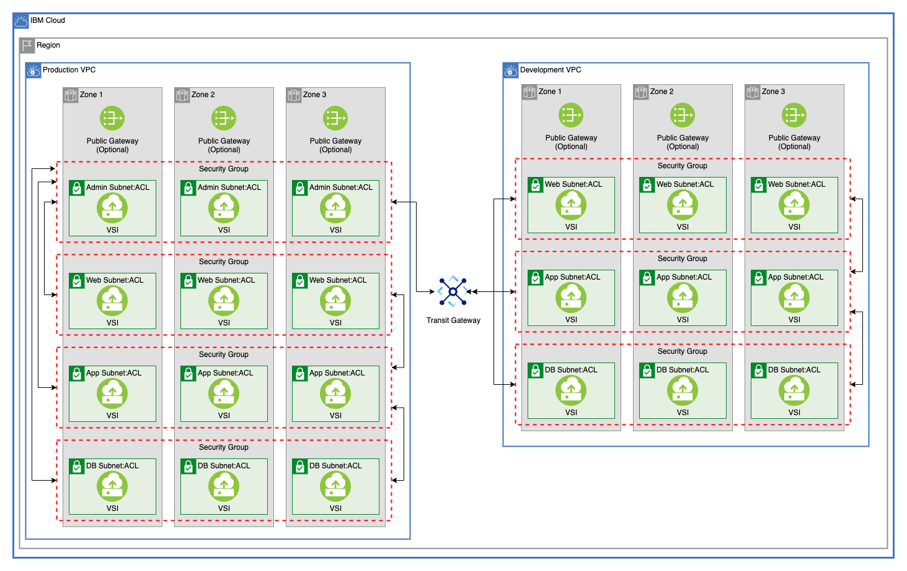

# Multitier VPC Network With Transit Gateway

This module creates two multitier VPCs and connects them via [IBM Cloud Transit Gateway](https://cloud.ibm.com/docs/transit-gateway?topic=transit-gateway-getting-started).

---

## Table of Contents

1. [Production VPC](##Production-VPC)
2. [Development VPC](##Development-VPC)
3. [Transit Gateway](##Transit-Gateway)
4. [Variables](##Variables)

---

## Production VPC

This creates a VPC with four tiers, `admin`, `web`, `application`, and `database`. As an example, each subnet contains a single Virtual Server where NGINX will be installed.

### Production Security Group Rules

Each tier of VSI are contained in a security group with dynamically created rules to route traffic. There is a quota of 5 on security-group-to-security-group rules, but this can be increased. For this example, each security group has a rule to allow all outbound traffic.

#### Admin Security Group

This security group allows all traffic from the `web`, `application`, and `database` tiers. Rules are also created to allow traffic from each subnet in the Development VPC.

#### Web Security Group

This security group allows all traffic from the `application` and `admin` tiers.

#### Application Security Group

This security group allows all traffic from the `admin`, `web`, and `database` tiers.

#### Database Security Group

This security group allows all traffic from the `application` and `admin` tiers.

---

## Development VPC

This module creates a VPC with three tiers, `application`, `web`, and `database`.

### Development Security Group Rules

Each VSI in this tier are created in a security group with dynamically created rules to route traffic. Each of these groups has rules to allow all traffic from all of the Production `admin` tier subnets.

#### Web Security Group

This security group allows all traffic from the `application` tier.

#### Application Security Group

This security group allows all traffic from the `web`, and `database` tiers.

#### Database Security Group

This security group allows all traffic from the `application` tier.

--

## Transit Gateway

Once both VPCs have been created, an IBM Cloud Transit Gateway is created and each VPC is connected. This allows each VPC to connect as though they shared a network. In order for these connections to work, neither VPC can have any overlapping CIDR blocks.

---

## Variables

Variable                                          | Type         | Description                                                                                | Default
------------------------------------------------- | ------------ | ------------------------------------------------------------------------------------------ |--------
ibmcloud_api_key                                  | string       | The IBM Cloud platform API key needed to deploy IAM enabled resources                      | 
unique_id                                         | string       | A unique identifier need to provision resources. Must begin with a letter                  | `"asset-multizone"`
ibm_region                                        | string       | IBM Cloud region where all resources will be deployed                                      | 
resource_group                                    | string       | Name of resource group where all infrastructure will be provisioned                        | `"asset-development"`
generation                                        | number       | generation for VPC. Can be 1 or 2                                                          | `2`
production_vpc_enable_public_gateway              | bool         | Enable public gateways for subnets, true or false                                          | `false`
production_vpc_acl_rules                          |              | Access control list rule set for all subnets                                               | `[` `{` `name = "allow-all-inbound"` `action = "allow"` `source = "0.0.0.0/0"` `destination = "0.0.0.0/0"` `direction = "inbound"` `},` `{` `name = "allow-all-outbound"` `action = "allow"` `source = "0.0.0.0/0"` `destination = "0.0.0.0/0"` `direction = "outbound"` `},` `]`
production_vpc_default_security_group_rules       |              | List of security group rules to be added to security group                                 | `{` `allow_all_inbound = {` `source = "0.0.0.0/0"` `direction = "inbound"` `}` `}`
production_vpc_zones                              | number       | Create subnets and VSI across 1, 2, or 3 zones                                             | `3`
production_vpc_application_tier_cidr_blocks       | list(string) | CIDR blocks for Production VPC Application Tier                                            | `[ "10.10.10.0/28", "10.20.10.0/28", "10.30.10.0/28" ]`
production_vpc_admin_tier_cidr_blocks             | list(string) | CIDR blocks for Production VPC Admin Tier                                                  | `[ "10.40.10.0/28", "10.50.10.0/28", "10.60.10.0/28" ]`
production_vpc_database_tier_cidr_blocks          | list(string) | CIDR blocks for Production VPC Database Tier                                               | `[ "10.70.10.0/28", "10.80.10.0/28", "10.90.10.0/28" ]`
production_vpc_web_tier_cidr_blocks               | list(string) | CIDR blocks for Production VPC Web Tier                                                    | `[ "10.100.10.0/28", "10.110.10.0/28", "10.120.10.0/28" ]`
development_vpc_enable_public_gateway             | bool         | Enable public gateways for subnets, true or false                                          | `false`
development_vpc_acl_rules                         |              | Access control list rule set for all subnets                                               | `[` `{` `name = "allow-all-inbound"` `action = "allow"` `source = "0.0.0.0/0"` `destination = "0.0.0.0/0"` `direction = "inbound"` `},` `{` `name = "allow-all-outbound"` `action = "allow"` `source = "0.0.0.0/0"` `destination = "0.0.0.0/0"` `direction = "outbound"` `},` `]`
development_vpc_default_security_group_rules      |              | List of security group rules to be added to security group                                 | `{` `allow_all_inbound = {` `source = "0.0.0.0/0"` `direction = "inbound"` `}` `}`
development_vpc_zones                             | number       | Create subnets and VSI across 1, 2, or 3 zones                                             | `3`
production_application_tier_image                 | string       | Image name used for VSI. Run 'ibmcloud is images' to find available images in a region     | `"ibm-centos-7-6-minimal-amd64-2"`
production_application_tier_machine_type          | string       | VSI machine type. Run 'ibmcloud is instance-profiles' to get a list of regional profiles   | `"cx2-2x4"`
production_application_tier_security_group_rules  |              | List of security group rules to be added to security group                                 | `{` `allow_all_outbound = {` `source = "0.0.0.0/0"` `direction = "outbound"` `}` `}`
production_database_tier_image                    | string       | Image name used for VSI. Run 'ibmcloud is images' to find available images in a region     | `"ibm-centos-7-6-minimal-amd64-2"`
production_database_tier_machine_type             | string       | VSI machine type. Run 'ibmcloud is instance-profiles' to get a list of regional profiles   | `"cx2-2x4"`
production_database_tier_security_group_rules     |              | List of security group rules to be added to security group                                 | `{` `allow_all_outbound = {` `source = "0.0.0.0/0"` `direction = "outbound"` `}` `}`
production_admin_tier_image                       | string       | Image name used for VSI. Run 'ibmcloud is images' to find available images in a region     | `"ibm-centos-7-6-minimal-amd64-2"`
production_admin_tier_machine_type                | string       | VSI machine type. Run 'ibmcloud is instance-profiles' to get a list of regional profiles   | `"cx2-2x4"`
production_admin_tier_security_group_rules        |              | List of security group rules to be added to security group                                 | `{` `allow_all_outbound = {` `source = "0.0.0.0/0"` `direction = "outbound"` `}` `}`
production_web_tier_image                         | string       | Image name used for VSI. Run 'ibmcloud is images' to find available images in a region     | `"ibm-centos-7-6-minimal-amd64-2"`
production_web_tier_machine_type                  | string       | VSI machine type. Run 'ibmcloud is instance-profiles' to get a list of regional profiles   | `"cx2-2x4"`
production_web_tier_security_group_rules          |              | List of security group rules to be added to default security group                         | `{` `allow_all_outbound = {` `source = "0.0.0.0/0"` `direction = "outbound"` `}` `}`
development_vpc_application_tier_cidr_blocks      | list(string) | CIDR blocks for development VPC Application Tier                                           | `[ "172.16.0.0/24", "172.16.1.0/24", "172.16.2.0/24" ]`
development_vpc_database_tier_cidr_blocks         | list(string) | CIDR blocks for development VPC Database Tier                                              | `[ "172.16.3.0/24", "172.16.4.0/24", "172.16.5.0/24" ]`
development_vpc_web_tier_cidr_blocks              | list(string) | CIDR blocks for development VPC Web Tier                                                   | `[ "172.16.6.0/24", "172.16.7.0/24", "172.16.8.0/24" ]`
development_application_tier_image                | string       | Image name used for VSI. Run 'ibmcloud is images' to find available images in a region     | `"ibm-centos-7-6-minimal-amd64-2"`
development_application_tier_machine_type         | string       | VSI machine type. Run 'ibmcloud is instance-profiles' to get a list of regional profiles   | `"cx2-2x4"`
development_application_tier_security_group_rules |              | List of security group rules to be added to security group                                 | `{` `allow_all_outbound = {` `source = "0.0.0.0/0"` `direction = "outbound"` `}` `}`
development_database_tier_image                   | string       | Image name used for VSI. Run 'ibmcloud is images' to find available images in a region     | `"ibm-centos-7-6-minimal-amd64-2"`
development_database_tier_machine_type            | string       | VSI machine type. Run 'ibmcloud is instance-profiles' to get a list of regional profiles   | `"cx2-2x4"`
development_database_tier_security_group_rules    |              | List of security group rules to be added to security group                                 | `{` `allow_all_outbound = {` `source = "0.0.0.0/0"` `direction = "outbound"` `}` `}`
development_web_tier_image                        | string       | Image name used for VSI. Run 'ibmcloud is images' to find available images in a region     | `"ibm-centos-7-6-minimal-amd64-2"`
development_web_tier_machine_type                 | string       | VSI machine type. Run 'ibmcloud is instance-profiles' to get a list of regional profiles   | `"cx2-2x4"`
development_web_tier_security_group_rules         |              | List of security group rules to be added to default security group                         | `{` `allow_all_outbound = {` `source = "0.0.0.0/0"` `direction = "outbound"` `}` `}`
ssh_public_key                                    | string       | ssh public key to use for vsi                                                              | 