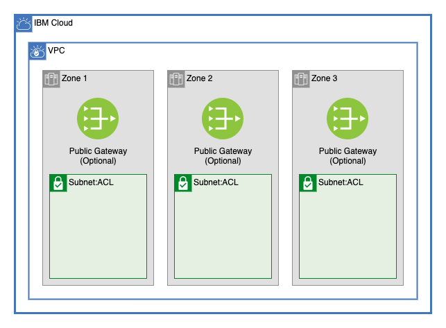

# Multizone VPC

This module creates a multizone VPC in a single region in 3 zones. It will create an example ACL and can optionally create public gateways for each zone. 

## Table of Contents

1. [VPC](##VPC)
2. [Subnets](##Subnets)
3. [Public Gateway](##public%20gateway)
4. [Access Control List (ACL)](##Access%20Control%20List)
5. [Module Variables](##module%20variables)
6. [Outputs](##Outputs)
7. [As a Module in a Larger Architecture](##As-a-Module-in-a-Larger-Architecture)

------

## VPC

This module creates a VPC in a single region inside a resource group.

Use IBM Cloud™ Virtual Private Cloud to create your own space in IBM Cloud™. A virtual private cloud (VPC) is a secure, isolated virtual network that combines the security of a private cloud with the availability and scalability of IBM's public cloud. [1](https://cloud.ibm.com/docs/vpc?topic=vpc-about-vpc)

### VPC Specific Variables

- `classic_access` - Can be `true` or `false`. 

- You can set up access from a VPC to your IBM Cloud classic infrastructure, including Direct Link connectivity. One VPC per region can communicate with classic resources.[2](https://cloud.ibm.com/docs/vpc?topic=vpc-about-vpc#about-classic-access)

#### More Info

- [Read more about VPC](https://cloud.ibm.com/docs/vpc?topic=vpc-about-vpc)

-------

## Subnets

This module creates any of number of subnets in each of up to 3 geographic zones in the region where the VPC was created.

Each subnet consists of a specified IP address range (CIDR block). Subnets are bound to a single zone, and they cannot span multiple zones or regions. Subnets in the same VPC are connected to each other. [3](https://cloud.ibm.com/docs/vpc?topic=vpc-about-networking-for-vpc#subnets-in-the-vpc)

### Subnet Specific Variables

- `cidr_blocks` - List of IP ranges
        - A list of IP address ranges within the VPC where the subnet will be created. There must be a cidr block for each subnet created.
        - Cannot be a [reserved IP address](https://cloud.ibm.com/docs/vpc?topic=vpc-about-networking-for-vpc#reserved-ip-addresses)
        - If no CIDR blocks are provided, it will create subnets with 256 total ipv4 addresses.

-----

## Public Gateway

This module can optionally create public gateways attached to the subnets.

A Public Gateway enables a subnet and all its attached virtual server instances to connect to the internet. Subnets are private by default. After a subnet is attached to the public gateway, all instances in that subnet can connect to the internet. Although each zone has only one public gateway, the public gateway can be attached to multiple subnets.[4](https://cloud.ibm.com/docs/vpc?topic=vpc-about-networking-for-vpc#public-gateway-for-external-connectivity)

-----

## Access Control List

This module creates an ACL and attaches it to the subnets

You can use an access control list (ACL) to control all incoming and outgoing traffic in IBM Cloud™ Virtual Private Cloud. An ACL is a built-in, virtual firewall, similar to a security group. In contrast to security groups, ACL rules control traffic to and from the subnets, rather than to and from the instances.[5](https://cloud.ibm.com/docs/vpc?topic=vpc-using-acls)

-------

## Module Variables

Variable              | Type   | Description                                                                        | Default
--------------------- | ------ | ---------------------------------------------------------------------------------- |--------
unique_id             | string | A unique identifier need to provision resources. Must begin with a letter          | `"asset-multizone"`
ibm_region            | string | IBM Cloud region where all resources will be deployed                              | 
resource_group_id     | string | ID of resource group to create VPC                                                 | 
classic_access        | bool   | Enable VPC Classic Access. Note: only one VPC per region can have classic access   | `false`
enable_public_gateway | bool   | Enable public gateways for subnets, true or false                                  | `true`
cidr_blocks           | list   | A list of tier subnet CIDR blocks                                                  | `[ "10.10.10.0/24", "10.10.20.0/24", "10.10.30.0/24" ]`
acl_rules             | list   | Access control list rule set                                                       | `[` `{` `name = "allow-all-inbound"` `action = "allow"` `source = "0.0.0.0/0"` `destination = "0.0.0.0/0"` `direction = "inbound"` `},` `{` `name = "allow-all-outbound"` `action = "allow"` `source = "0.0.0.0/0"` `destination = "0.0.0.0/0"` `direction = "outbound"` `}` `]`
security_group_rules  | map    | List of security group rules to be added to default security group                 | `{` `allow_all_inbound = {` `source = "0.0.0.0/0"` `direction = "inbound"` `}` `}`

-----

## Outputs

| Name                | Value                                        |
| ------------------- | -------------------------------------------- |
| `subnet_ids`        | List of subnets created by module            |
| `acl_id`            | ID of ACL Created                            |
| `tier_3_subnet_ids` | List of subnets created by module for tier 3 |
| `vpc_id`            | ID of VPC created                            |
